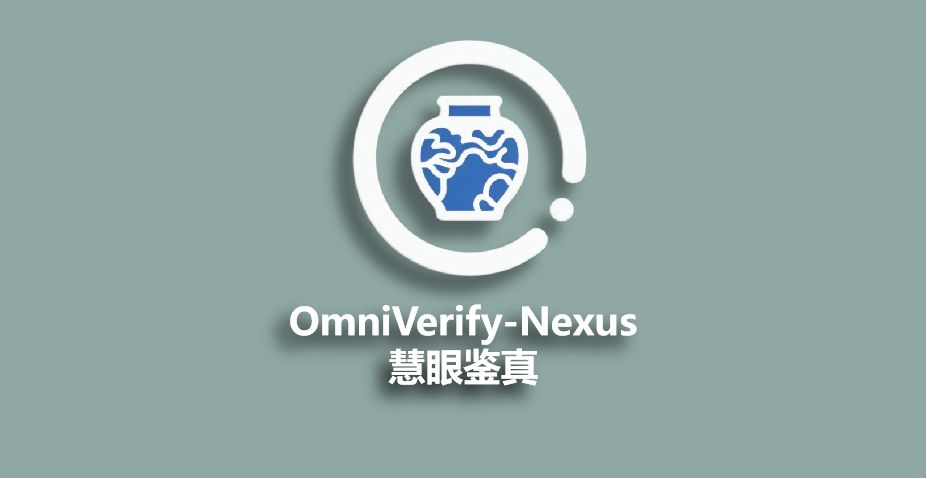

<div align="center">

#  Code release for OmnVerify-Nexus 慧眼鉴真——基于Omniglue的钧瓷真伪鉴别系统

<p align="center">
    <a href="https://eating-cpp.github.io/">Yujie Li</a>,
    <a href="https://github.com/Kouyr">Kouyan Ru</a>
</p>

</div>

-------------------------------------------------------------------------------


<div align="center">
We hereby declare that our project is developed using the publicly available model Omniglue from a 2024 CVPR paper.

[[The original project Omniglue]]((https://github.com/google-research/omniglue))
</div>

<br>





**Introduction**  
Aiming at the counterfeiting problem in the Jun porcelain industry of Shenhou Town, Yuzhou, Henan, which causes annual losses exceeding 20 million yuan, our team has developed an intelligent anti-counterfeiting system for Jun porcelain based on the OmniGlue algorithm (2024 CVPR). Traditional manual identification relies on microscopic features such as glaze crazing patterns and "earthworm walking mud" patterns, suffering from defects like low efficiency and strong subjectivity.
This system innovatively decouples the global shape of porcelain (using DINOv2 for semantic modeling) from local microscopic textures (Superpoint feature matching). Combined with a dynamic weight scoring mechanism, it achieves adaptive fusion of multi-angle captured images. The measured identification accuracy reaches 98.2%, and the processing time for a single image is <0.5 seconds. It supports museums, auction houses, and manufacturers in establishing permanent digital fingerprint libraries for genuine products, offering two modes: fast screening with adjustable confidence and high-precision identification. This provides an AI guardianship solution of "difficult to replicate, traceable" for the brand value of Jun porcelain, pushing the digital protection of cultural heritage into the millisecond era.


## Installation

First, use pip to install `omniglue`:

```sh
conda create -n omniglue pip
conda activate omniglue

git clone https://github.com/google-research/omgitniglue.
cd omniglue
pip install -e .
```

Then, download the following models to `./models/`

```sh
# Download to ./models/ dir.
mkdir models
cd models

# SuperPoint.
git clone https://github.com/rpautrat/SuperPoint.git
mv SuperPoint/pretrained_models/sp_v6.tgz . && rm -rf SuperPoint
tar zxvf sp_v6.tgz && rm sp_v6.tgz

# DINOv2 - vit-b14.
wget https://dl.fbaipublicfiles.com/dinov2/dinov2_vitb14/dinov2_vitb14_pretrain.pth

# OmniGlue.
wget https://storage.googleapis.com/omniglue/og_export.zip
unzip og_export.zip && rm og_export.zip
```

Direct download links:

-   [[SuperPoint weights]](https://github.com/rpautrat/SuperPoint/tree/master/pretrained_models): from [github.com/rpautrat/SuperPoint](https://github.com/rpautrat/SuperPoint)
-   [[DINOv2 weights]](https://dl.fbaipublicfiles.com/dinov2/dinov2_vitb14/dinov2_vitb14_pretrain.pth): from [github.com/facebookresearch/dinov2](https://github.com/facebookresearch/dinov2) (ViT-B/14 distilled backbone without register).
-   [[OmniGlue weights]](https://storage.googleapis.com/omniglue/og_export.zip)


So far, you can use our command - line version to interact with the software. Of course, we also provide a more user - friendly UI. You need to refer to the following link for configuration. [[How to install PyQt5]](https://blog.csdn.net/qq_37080185/article/details/121616507)

## Usage
The code snippet below outlines how you can perform OmniGlue inference in CMD.

```sh
conda activate omniglue
python OMNI.py
```

You will see the following expected output:

```sh
> 加载 OmniGlue（及其子模块：SuperPoint 和 DINOv2）...
>       耗时 XXXX 秒。

> 欢迎使用OMNI.py!


处理方式：1 从数据库加载特征进行匹配; 2 录入图片数据; 3 OMNIGLUE基本演示; Exit退出


>:请输入处理方式:

```
Then you can follow the instructions to use the software.

## System(with UI) Demo

Alternatively, you can use the following commands to activate the UI interface for a more efficient and convenient way to use the system:
```sh
conda activate omniglue
python main.py
```
Here is a demo video: [[OmniVerify-Nexus demo]](https://www.bilibili.com/video/BV1t83BziEyw/?vd_source=f7437a693bbdac0008462a64ef601912). Or you can find it at:  res/demo.mp4.


